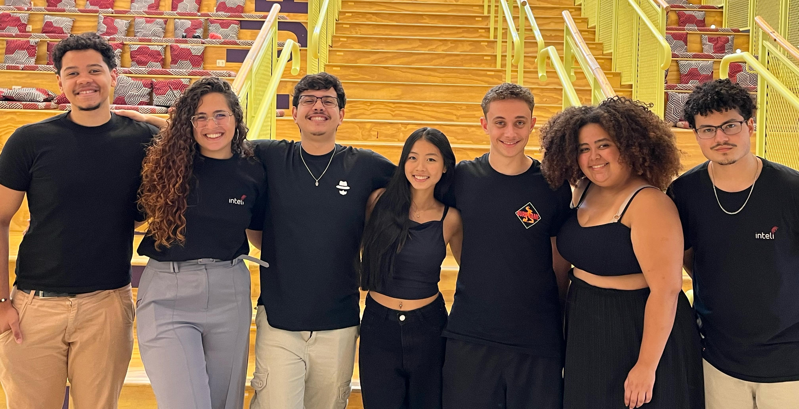
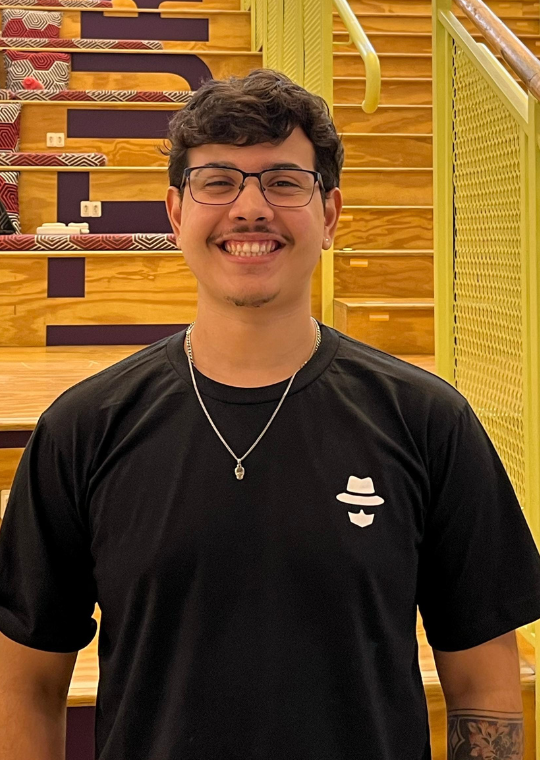
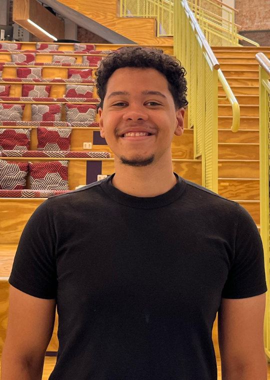
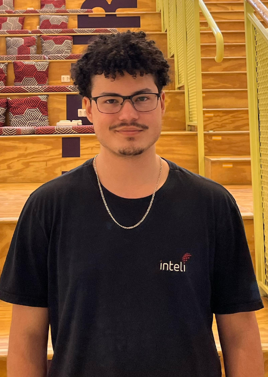
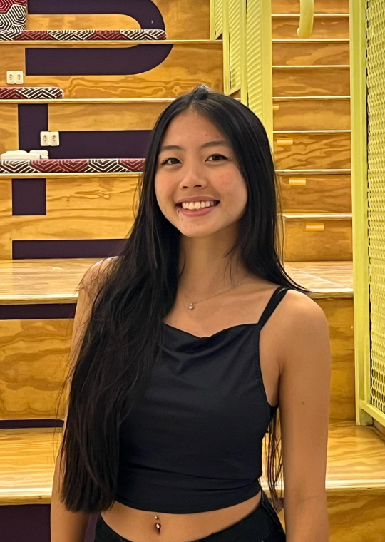
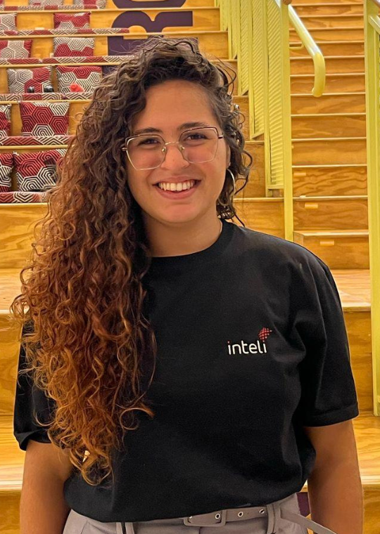

# Inteli - Instituto de Tecnologia e Liderança 
<br>
<p align="center">
<a href= "https://www.inteli.edu.br/"></a>
</p>
<br>

# Sistema Automatizado de Separação de Remédios em Ambiente Farmacêutico
<br>

<div style="width: 100%; max-width: 100%; text-align: center; margin: 0; padding: 0;">
  
  
  
</div>


<br>

## Equipe Prescript:
</img>

## 👨‍🎓 Integrantes: 

<div align="center">

<table style="border-collapse: collapse; width: 100%; max-width: 1500px;">
  <tr>
    <td align="center" style="padding: 15px; border: 0.5px solid #464646;">
        <br>
        <sub><b>Danilo Martins Merlo</b></sub><br><br>
         <a href="https://www.linkedin.com/in/danilo-martins-merlo-381b76228/"></a>
         <a href="https://github.com/DaniloMartinsMerlo"></a>
    </td>
    <td align="center" style="padding: 15px; border: 1px solid #464646;">
        <br>
        <sub><b>Davi Nascimento de Jesus</b></sub><br><br>
         <a href="https://www.linkedin.com/in/davi-nascimento-de-jesus/"></a>
        <a href="https://github.com/nDaviii"></a>
    </td>
    <td align="center" style="padding: 15px; border: 1px solid #464646;">
        <br>
        <sub><b>Gabriel Martins Alves</b></sub><br><br>
        <a href="https://linkedin.com/in/gabriel-martins-alves/"></a>
        <a href="https://github.com/GabrielMartinsAlves"></a>
    </td>
    <td align="center" style="padding: 15px; border: 1px solid #464646;">
        <br>
        <sub><b>João Victor Wandermurem</b></sub><br><br>
        <a href="https://www.linkedin.com/in/jo%C3%A3o-v-wandermurem/"></a>
        <a href="https://github.com/JvWandermurem"></a>
    </td>
    <td align="center" style="padding: 15px; border: 1px solid #464646;">
        <br>
        <sub><b>Mariella Sayumi Kamezawa</b></sub><br><br>
        <a href="https://www.linkedin.com/in/mariella-kamezawa/"></a>
        <a href="https://github.com/marikamezawa"></a> 
    </td>
    <td align="center" style="padding: 15px; border: 1px solid #464646;">
        <br>
        <sub><b>Rafaela Silva Lima</b></sub><br><br>
        <a href="https://www.linkedin.com/in/rafaela-s-o-lima/"></a>
        <a href="https://github.com/RafaelaSOLima"></a>
    </td>
    <td align="center" style="padding: 15px; border: 1px solid #464646;">
      <br>
      <sub><b>Yasmim Marly Passos</b></sub><br><br>
      <a href="https://www.linkedin.com/in/yasmim-passos/"></a>
      <a href="https://github.com/yasmimpassos"></a>
    </td>
  </tr>
</table>

</div>


## 👩‍🏫 Professores:
### Orientador(a) 
- <a href="https://www.linkedin.com/in/murilo-zanini-de-carvalho-0980415b/">Murilo Zanini de Carvalho</a>
### Instrutores
- <a href="https://www.linkedin.com/in/andregodoichiovato/">André Godoi Chiovato</a>
- <a href="https://www.linkedin.com/in/filipe-gon%C3%A7alves-08a55015b/">Filipe Gonçalves</a>
- <a href="https://www.linkedin.com/in/geraldo-magela-severino-vasconcelos-22b1b220/">Geraldo Magela Severino Vasconcelos</a>
- <a href="https://www.linkedin.com/in/gui-cestari/">Guilherme Cestari</a>
- <a href="https://www.linkedin.com/in/lisane-valdo/">Lisane Valdo</a> 
- <a href="https://www.linkedin.com/in/rodrigo-mangoni-nicola-537027158/">Rodrigo Mangoni Nicola</a> 

## 📜 Descrição

&emsp;A solução Prescript é um projeto inovador desenvolvido pelos alunos do 5º módulo de Automação com Garra Robôtica do 2º ano da faculdade Inteli, em parceria com o Hospital de Clínicas da Unicamp. O sistema visa resolver o desafio crítico da separação manual de medicamentos para pacientes internados, que é suscetível a erros humanos, como duplicidade, falhas de separação e desperdício. O sistema automatiza todo o processo, garantindo maior segurança, agilidade e precisão na entrega dos medicamentos.

&emsp;O sistema utiliza uma interface por aplicação web, permitindo sua operação através de um fluxo sim. A integração com o leitor de QR Code é um ponto chave da solução, pois permite a validação automática dos medicamentos antes da coleta. O robô, então, utiliza essas informações para identificar e conferir os produtos, garantindo que cada item seja o correto antes de ser incluído no kit de medicamentos do paciente.

&emsp;A movimentação do robô Dobot foi otimizada continuamente para garantir precisão e eficiência durante o processo de coleta e movimentação dos medicamentos. O sistema permite que o robô execute o movimento de coleta com alta precisão, reduzindo significativamente o tempo necessário para a montagem das Fitas de Medicamentos. Isso permite que a equipe farmacêutica se concentre em tarefas mais críticas, como a revisão de protocolos e assistência farmacêutica direta.

&emsp;A principal funcionalidade do sistema é a automação do processo de separação de medicamentos, o que não só facilita a operação em ambientes farmacêuticos e hospitalares, mas também minimiza os erros humanos e melhora a eficiência do processo. O robô é capaz de validar os medicamentos automaticamente, coletá-los e movê-los com precisão, garantindo a segurança e a agilidade do processo de entrega.

&emsp;Com o objetivo de melhorar a produtividade, a segurança e a confiabilidade dos processos de separação de medicamentos, a solução Prescript se apresenta como uma inovação tecnológica no mercado farmacêutico, estabelecendo um novo padrão para a gestão automatizada de medicamentos em ambientes hospitalares.


## 📁 Estrutura de pastas

Dentre os arquivos e pastas presentes na raiz do projeto, definem-se:

- <b>assets</b>: aqui estão os arquivos relacionados à parte gráfica da visualização inicial do projeto, através desse material em markdown.

- <b>document</b>: aqui estão todos os documentos do projeto, incluindo a documentação desenvolvida em docusaurus. Há também outros documentos complementares e os recursos visuais aplicados na documentação.

- <b>src</b>: Todo o código fonte criado para o desenvolvimento do projeto, incluindo o código desenvolvido para o robô e para a aplicação web.

- <b>README.md</b>: arquivo que serve como guia e explicação geral sobre o projeto.

## 🔧 Instalação

&emsp;Esta seção apresenta os passos necessários para configurar o ambiente virtual do projeto, garantindo uma experiência eficiente durante o uso.

### **⌨️ Execução do Código do Robô**  

&emsp;Para executar a **CLI** do robô, basta ter o **Python instalado** em sua máquina. Em seguida, siga os passos abaixo para configurar seu ambiente:  

#### **1.1 Acesse a pasta `src` na raiz do repositório**  
```sh
cd src
```

#### **1.2 Crie um ambiente virtual para instalar as dependências do projeto**
```sh
python3 -m venv nome_da_venv
```

#### **1.3 Ative o ambiente virtual**
- No Linux ou macOS
```sh
source nome_da_venv/bin/activate
```
- No Windows
```sh
nome_da_venv\Scripts\Activate
```

#### **1.4 Instale as bibliotecas necessárias**
```sh
pip install -r requirements.txt
```

#### **1.5 Execute a CLI do robô**
```sh
python3 cli.py --help
```

&emsp;Esse comando exibe todas as funções disponíveis na CLI, permitindo começar a operar o robô.

### **📄 Documentação**
&emsp;Para visualizar a documentação no **Docusaurus**, siga os passos abaixo:  

#### **2.1 Acesse a pasta `docs`**  
```sh
cd docs
```

#### **2.2 Instale os pacotes necessários**

```sh
npm install
```

#### **2.3 Inicie o servidor local**
```sh
npm start
```
## 🗃 Histórico de lançamentos

* 0.5.0 - 11/04/2025
    * **[Sprint 5] Refinamento e Revisão** <br><br>
* 0.4.0 - 28/03/2025
    * **[Sprint 4] Integração da Aplicação ao Robô** <br><br>
* 0.3.0 - 14/03/2025
    * **[Sprint 3] Integração do Leitor de QR Code** <br><br>
* 0.2.0 - 28/02/2025
    * **[Sprint 2] Wireflow e Automação Básica** <br><br>
* 0.1.0 - 14/02/2025
    * **[Sprint 1] Entendimento do Negócio e do Usuário** 

#


<br>

<div style="width: 100%; max-width: 100%; text-align: center; margin: 0; padding: 0;">
  
  
  
</div>
<br>

## 📋 Licença/License

<p xmlns:cc="http://creativecommons.org/ns#" xmlns:dct="http://purl.org/dc/terms/"><a property="dct:title" rel="cc:attributionURL" href="https://github.com/Inteli-College/2025-1A-T12-EC05-G05">Prescript</a> by <a rel="cc:attributionURL dct:creator" property="cc:attributionName" href="https://www.inteli.edu.br/">INTELI,</a> <a rel="cc:attributionURL dct:creator" property="cc:attributionName" href="https://github.com/DaniloMartinsMerlo">DANILO MARTINS MERLO</a>, </a><a rel="cc:attributionURL dct:creator" property="cc:attributionName" href="https://github.com/nDaviii">DAVI NASCIMENTO DE JESUS</a>, <a rel="cc:attributionURL dct:creator" property="cc:attributionName" href="https://github.com/GabrielMartinsAlves">GABRIEL MARTINS ALVES</a>, <a rel="cc:attributionURL dct:creator" property="cc:attributionName" href="https://github.com/JvWandermurem">JOÃO VICTOR WANDERMUREM</a>, <a rel="cc:attributionURL dct:creator" property="cc:attributionName" href="https://github.com/marikamezawa">MARIELLA SAYUMI MERCADO KAMEZAWA</a>, <a rel="cc:attributionURL dct:creator" property="cc:attributionName" href="https://github.com/RafaelaSOLima">RAFAELLA SANTOS OLIVEIRA LIMA</a>, <a rel="cc:attributionURL dct:creator" property="cc:attributionName" href="https://github.com/yasmimpassos">YASMIM MARLY PASSOS</a> is licensed under <a href="https://creativecommons.org/licenses/by/4.0/?ref=chooser-v1" target="_blank" rel="license noopener noreferrer" style="display:inline-block;">Creative Commons Attribution 4.0 International</a></p>
